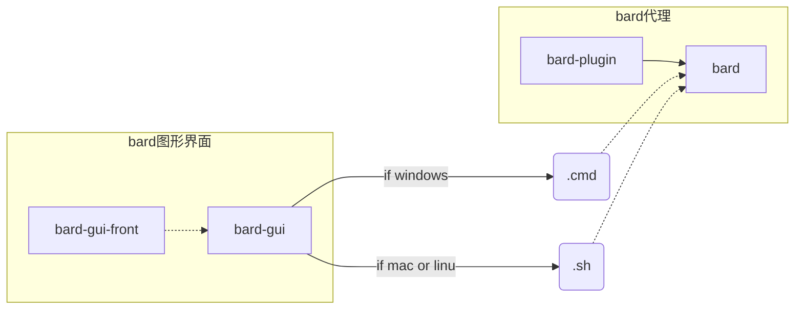

### GUI程序的一个大体方案

写这个的时候想起了我写本科某论文，当时看着大家都有一类器件之间的对比和选择，于是乎也加了点这样的内容。其实我对这些内容是有些反感的。反感的不是内容本身，而是没有经过思考的对比，有时候两种方案或者更多方案摆在眼前的时候也许并不会去选最优的，而是选择最适合。

对bard项目的思考记录如下。

项目暂且包含**repository**如下：

 1. bard主项目
 2. bard插件
 3. bard-gui 
 4. bard前端   

#### 1. 各repository功能、职责介绍

1.1 bard [https://github.com/GuoYuefei/bard](https://github.com/GuoYuefei/bard)

​	本包是核心项目，主要负责代理数据的整理、搬运以及代理权限的认证，从网络七层结构上看，主要实现的是会话和表示层功能。可以单独运行，包含server和client两个配套程序。 在最初本人自使用的时候用的就是这两个程序，后来才写了简单脚本控制程序开关，之后才有的gui的想法。说这么多，重点强调的是，本包是一个可运行的项目。

1.2 bard-plugin [https://github.com/GuoYuefei/bard-plugin](https://github.com/GuoYuefei/bard-plugin)

​	本包为bard项目提供数据加密、解密、以及解决tcp粘包问题（粘包是流式传输的通病）。作为一个插件项目必须与bard项目配合使用，也必须实现bard中规定的接口才能发挥作用。

1.3 bard-gui [https://github.com/GuoYuefei/bard-gui](https://github.com/GuoYuefei/bard-gui)

​	本包为bard的gui程序，主要提供的就是界面，而界面来源于bard-gui-front项目。

1.4 bard-gui-front [https://github.com/GuoYuefei/bard_gui_front](https://github.com/GuoYuefei/bard_gui_front)

​	本包为react项目，为gui程序提供了web界面。


#### 2. 整体项目的框架图




### 大体的目录结构设计

---
```
|-- public
    |-- 这个是由https://github.com/GuoYuefei/bard_gui_front编译决定
|-- _server
	|-- _handle						// 接收消息并作出相关操作，操作有operate文件夹内提供
		|-- _每个handle一个目录
		|-- serve_mux.go					// 总handle
	|-- _operate								// 系统操作
		|-- modify_config.go
		|-- open_bard.go
        |-- stop_bard.go
        |-- restart.go
        |-- _office_plugin_config					// 官方插件管理页面
        -------
        |-- _隧道相关操作			  				// 将来bard版本 隧道的安装、设置、开启、关闭
        |-- 模式控制.go					// 手动、全局、pac、自动（先本地直连，后代理，如果成功记录自动pac文件）
    |-- server.go							// 启动server自动打开游览器界面
|-- _bard										// 具体目录结构由bard项目及其子项目决定
    |-- bard.sh							// bard的脚本文件
    |-- ...
|-- _tun2socks
    |-- ...
```

## 最简API设计

|           URI           |              操作              | 成功返回 | 失败返回 |       备注       |
| :---------------------: | :----------------------------: | :------: | :------: | :--------------: |
|            /            |  进入index.html页面(包含配置)  | 页面本身 |    无    |                  |
|       /bard/start       |            开启bard            |    0     |    !0    |  需要定义错误码  |
|       /bard/stop        |              关闭              |    0     |    !0    |       同上       |
|      /bard/restart      |              重启              |    0     |    !0    |       同上       |
|   /bard/config/Update   |   携带表单数据，更新配置文件   |    0     |   非零   | 需要定义表单数据 |
| /bard/plugin/index.html |        官方插件配置页面        | 页面本身 |    无    |                  |
|   /bard/plugin/config   | 携带表单数据，更新插件配置文件 |    0     |    !0    | 需要定义表单数据 |
|      /bard/install      |     一键安装bard的所有东西     |    0     |    !0    |      错误码      |
|    /bard/unintstall     |       卸载bard的所有东西       |    0     |    !0    |       同上       |